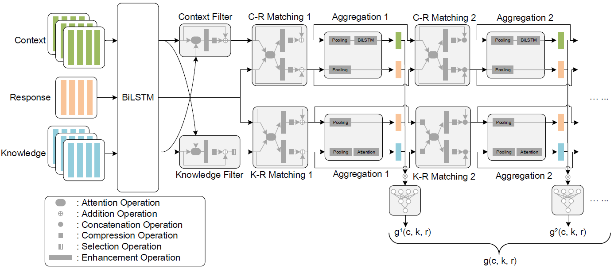
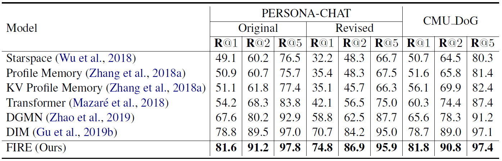

# Filtering before Iteratively Referring for Knowledge-Grounded Response Selection in Retrieval-Based Chatbots
This repository contains the source code and datasets for the EMNLP 2020 paper [Filtering before Iteratively Referring for Knowledge-Grounded Response Selection in Retrieval-Based Chatbots](https://arxiv.org/pdf/2004.14550.pdf) by Gu et al. <br>

Our proposed **Filtering before Iteratively REferring (FIRE)** model has achieved a new state-of-the-art performance of knowledge-grounded response selection on the PERSONA-CHAT and CMU_DoG datasets.


## Model overview



## Results



## Dependencies
Python 2.7 <br>
Tensorflow 1.4.0


## Datasets
Your can download the datasets and their corresponding embedding and vocabulary files used in our paper from the following links. <br>

- [PERSONA-CHAT](https://drive.google.com/open?id=1gNyVL5pSMO6DnTIlA9ORNIrd2zm8f3QH) and its [embedding and vocabulary files](https://drive.google.com/open?id=1gGZfQ-m7EGo5Z1Ts93Ta8GPJpdIQqckC). <br>
- [CMU_DoG](https://drive.google.com/file/d/1GYKelOS9_yvc66fe9NqMnxWAwYAfoIzP/view?usp=sharing) and its [embedding and vocabulary files](https://drive.google.com/file/d/1vCm2shBE2ZxPI1Vw6bmCVv3xujVL72Xs/view?usp=sharing). <br>

Unzip the datasets to the folder of ```data``` and run the following commands. The processed files are stored in ```data/personachat_processed/``` or ```data/cmudog_processed/```. <br>
```
cd data
python data_preprocess_pc.py
python data_preprocess_cd.py
```
Then, unzip their corresponding embedding and vocabulary files to the folder of ```data/personachat_processed/``` or ```data/cmudog_processed/```.


## Train a new model
Take PERSONA-CHAT as an example.
```
cd scripts
bash train_personachat.sh
```
The training process is recorded in ```log_FIRE_train_personachat_original.txt``` file.

## Test a trained model
```
bash test_personachat.sh
```
The testing process is recorded in ```log_FIRE_test_personachat_original.txt``` file. And your can get a ```test_out_FIRE_personachat_original.txt``` file which records scores for each example. Run the following command and you can compute the metric of Recall.
```
python compute_recall.py
```


## Cite
If you use the code and datasets, please cite the following paper:
**"Filtering before Iteratively Referring for Knowledge-Grounded Response Selection in Retrieval-Based Chatbots"**
Jia-Chen Gu, Zhen-Hua Ling, Quan Liu, Zhigang Chen, Xiaodan Zhu. _EMNLP (2020)_

```
@inproceedings{gu-etal-2020-filtering,
    title = "Filtering before Iteratively Referring for Knowledge-Grounded Response Selection in Retrieval-Based Chatbots",
    author = "Gu, Jia-Chen  and
              Ling, Zhen-Hua  and
              Liu, Quan and 
              Chen, Zhigang and 
              Zhu, Xiaodan",
    booktitle = "Proceedings of the 2020 Conference on Empirical Methods in Natural Language Processing (EMNLP)",
    month = nov,
    year = "2020",
    address = "Punta Cana, Dominican Republic",
    publisher = "Association for Computational Linguistics",
}
```


## Acknowledgments
Thank [ParlAI](https://parl.ai/) for providing the PERSONA-CHAT dataset. <br>
Thank Xueliang Zhao for providing the processed CMU_DoG dataset used in their [paper](https://www.ijcai.org/Proceedings/2019/0756.pdf).


## Contact
Please keep an eye on this repository if you are interested in our work. <br>
Feel free to contact us (gujc@mail.ustc.edu.cn) or open issues.
